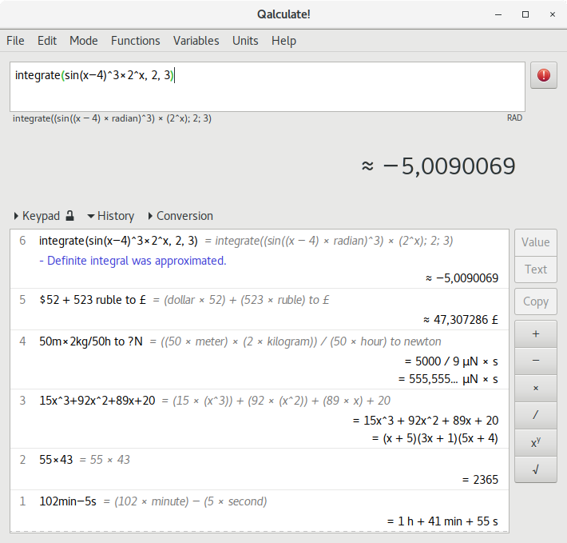

# qalculate-flatpak

**Qalculate!** is a multi-purpose cross-platform desktop calculator. It is simple to use but provides power and versatility normally reserved for complicated math packages, as well as useful tools for everyday needs (such as currency conversion and percent calculation). Features include a large library of customizable functions, unit calculations and conversion, symbolic calculations (including integrals and equations), arbitrary precision, uncertainty propagation, interval arithmetic, plotting, and a user-friendly interface (GTK+ and CLI).



[Homepage](http://qalculate.github.io)

This repo is about the flatpak package (Gtk+3).

## Instructions

### Requirements

* [flatpak](https://github.com/flatpak/flatpak)
* [flatpak-builder](https://github.com/flatpak/flatpak-builder)

For EL7:

```
# yum install 'flatpak' 'flatpak-builder'
```

You may also wish to install the `xdg-desktop-portal*` packages:

```
# yum install 'xdg-desktop-portal*'
```

See also:

* [flatpak setup](https://flatpak.org/setup)

### Adding repository

```
$ flatpak remote-add --if-not-exists "flathub" "https://dl.flathub.org/repo/flathub.flatpakrepo"
```

See also:

* [flathub setup](http://docs.flatpak.org/en/latest/using-flatpak.html#add-a-remote)

### Prepare

```
$ flatpak install "flathub" "org.gnome.Sdk//3.32"
```

```
$ flatpak install "flathub" "org.gnome.Platform//3.32"
```

Clone this repository, then checkout the right branch.

### Build

```
$ flatpak-builder "build" "io.github.qalculate.Qalculate.yaml" --force-clean --install-deps-from="flathub"
```

### Test

```
$ flatpak-builder --run "build" "io.github.qalculate.Qalculate.yaml" "sh"
```

### Test run

```
$ flatpak-builder --run "build" "io.github.qalculate.Qalculate.yaml" "qalculate-gtk"
```

### Create repo

```
$ flatpak-builder --repo="repo" --force-clean "build" "io.github.qalculate.Qalculate.yaml"
```

### Install

```
$ flatpak --user remote-add --no-gpg-verify "qalculate-gtk" "repo"
```

```
$ flatpak --user install "qalculate-gtk" "io.github.qalculate.Qalculate"
```

### Run

```
$ flatpak run "io.github.qalculate.Qalculate"
```

### Uninstall

```
$ flatpak --user uninstall "io.github.qalculate.Qalculate"
```

```
$ flatpak --user remote-delete "qalculate-gtk"
```

### Build single-file bundle

```
$ flatpak build-bundle "repo" "qalculate-gtk.flatpak" "io.github.qalculate.Qalculate" --runtime-repo="https://flathub.org/repo/flathub.flatpakrepo"
```

### Install single-file bundle

If you have already [installed](#install) the package, you have to [uninstall](#uninstall) it before continuing.

```
$ flatpak --user install "qalculate-gtk.flatpak"
```

See also:
* [Building your first Flatpak](http://docs.flatpak.org/en/latest/first-build.html)
* [Single-file bundles](http://docs.flatpak.org/en/latest/single-file-bundles.html#single-file-bundles)

## FAQ

### Are you the author of Qalculate/qalculate-gtk?

No, I only created the flatpak package for it.

See also:

* [GitHub repo](https://github.com/Qalculate/qalculate-gtk)

